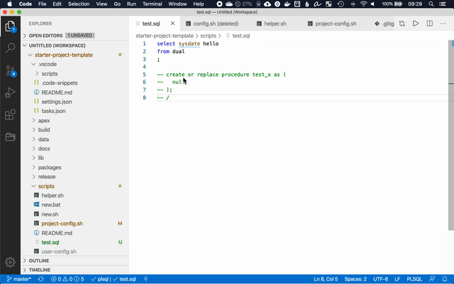

# MS Visual Studio Code Build Tasks

- [Setup](#setup)
  - [`tasks.json`](#tasksjson)
- [Tasks](#tasks)
  - [Compiling Code](#compiling-code)
  - [APEX Export](#apex-export)

[Microsoft Visual Studio Code (VSC)](https://code.visualstudio.com/) is a code editor and is recommended for most PL/SQL work. VSC can compile PL/SQL code directly from VSC (see [this blog](https://ora-00001.blogspot.ca/2017/03/using-vs-code-for-plsql-development.html)) for more information. Opening this project folder in VSC will automatically give you the ability to compile PL/SQL code and do APEX backups

## Setup

The first time you execute this script an error will be shown and `scripts/user-config.sh` will be created with some default values. Modify the variables as necessary. You may also need to modify the [`scripts/project-config.sh`](scripts/project-config.sh) file. See the documenation in the [`scripts`](scripts) folder for more info.

*Note: Windows users: Please ensure WSL or cmder is configured to run bash as terminal in VSC: [instructions](../README.md#windows-setup)*

### `tasks.json`

This file defines the VSCode task. The first time that anything bash script is run in this template (ex: build, compile, apex export, etc) the task names will automatically be updated to reflect the root project's folder name.

For example if the project is stored in `~/git/my-project` **after** the first bash script is run (see previous paragraph) the task names will look like: `compile: my-project` etc.

## Tasks

Tasks can be executed with `⌘+shift+B` and selecting the desired task.

### Compiling Code

To compile the current file you're editing execute `compile: <project name>` task.

### APEX Export

If you want to export your APEX applications (defined in `scripts/project-config.sh`) execute the `apex export: <project name>`
